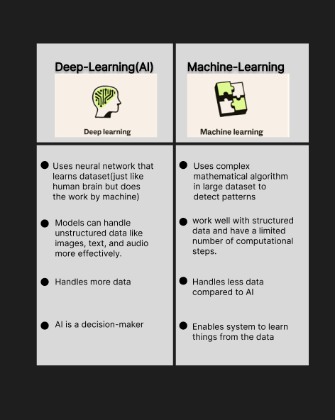
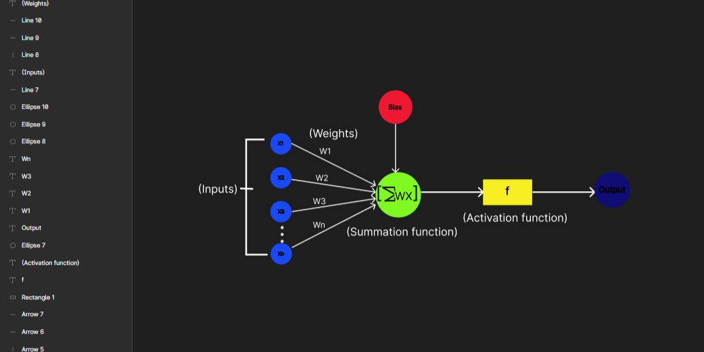

### What I learned during flipped class!

---

Hello there, I'm Tenzin Namgay, and this is my  journal entry about what I learned during the flipped class. I hope you are excited to learn about Deep learning fundamentals, which is the topic for this journal. Without any further, let's get started.
Firstly, let us understand what Artifical Intelligence is before going into depth.

AI is started by Arthur Samuel at ninteenth century, it is a machine and has ability to mimic human behaviour.
In this modern world, AI learns, improves and handle complex problem like converting text-to-speech, Image detection using python and many more.
With this understanding, Now the question comes;

# What are neurons in AI?
In artificial intelligence (AI), neurons refer to the basic units that make up artificial neural networks, which are computational models inspired by the biological neural networks found in the human brain.

Form my understanding, their function is to process and transmittt information by receving inputs, applying weights to these inputs,suming them and applying activation function to produce an output.
The result for the above procedure is they learn, make decisions and mimicking human behaviour.

Let us go through the differences between Machine Learning (ML) and Deep Learning (AI)

In summary,AI aims in focusing on developing deep neural networks capable of handling complex, unstructured data and make intelligent decisions. Whereas ML aims to develop MAthematical algorithms and models that can automatically learn patterns and relationships from data and make accurate prediction.

Now, lets talk about neurons in AI, they are computational units. 

# What is a Perceptron?

As above, Perceptron is a fundamental unit of a neural network, essentially functioning as an algorithm for supervised machine learning.
With the understanding of perceptron, let us go through single-layer perceptron and its serveral important components.

A single layer perceptron is one of the simplest forms of an artificial neural network.To talk about more, they are not capable of solving complex problems and can only learn to classify data. The result for this perceptron is binnary, classification decision.

It consists of several components:
1. Input(x)--> symbol
2. Weights(w)
3. Bias(b)
4. Weighted sum(z)
5. Activation function(t)
6. Output(y)

To give a simple description: A signal is received by a neuron from other neurons. Each signal (input) has a (weight) that contributes to the neuron's output. The (bias) allows the neuron to capture patterns even when the inputs are zero. Next, multiplying and adding the input weights together and adding the bias term is done at the weighted sum(summation function). Then, the (activation function) allows the neuron to learn complex patterns and finally determines the (output).

