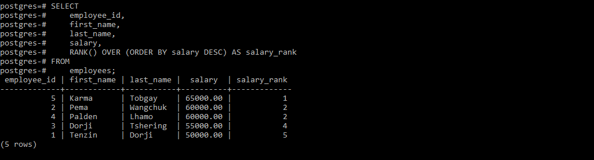
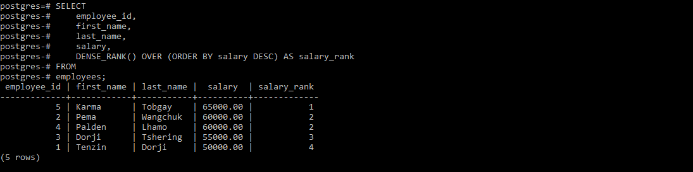
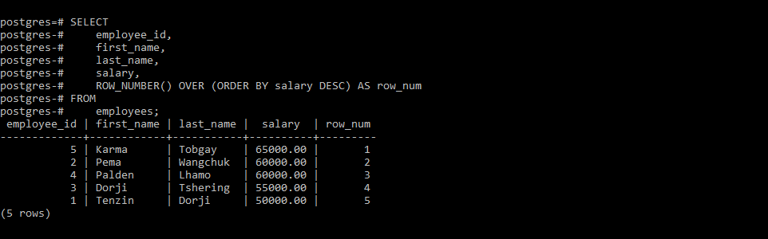
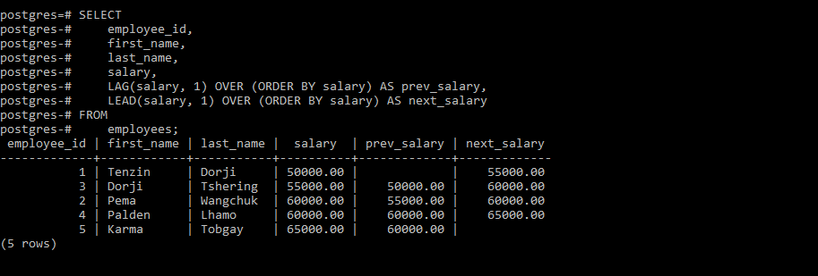
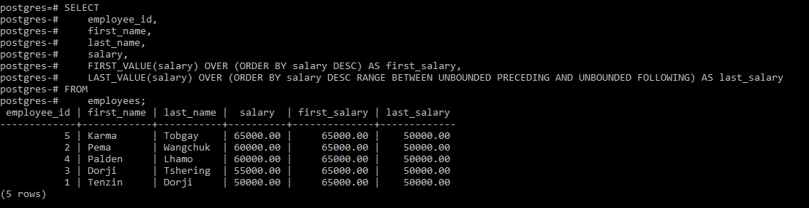
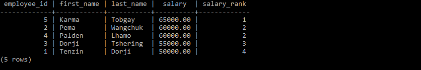
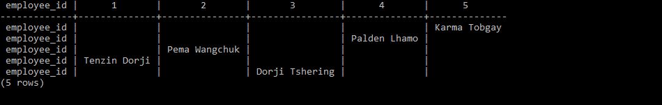
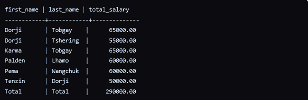
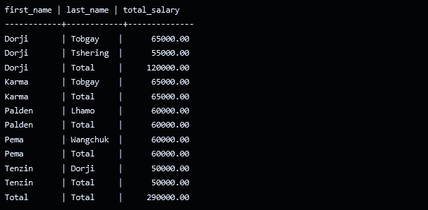

### What I learned during flipped class!
---

HEY! here is another journal on what I learned in Flipped class day four. Today i will explain on the topic Advanced Aggregate Functions and it's types. I hope you all are curious about it so, without any delay, lets get started.

From my understanding advanced aggregate functions in SQL are like powerful tools that can help you analyze and understand your data at a whole new level. Basic aggregate functions like SUM, AVG, and COUNT can give you some useful information, but they have their limitations. They can be categorized into four main types:

1. Boolean Aggregations
2. Statistical Aggregations
3. Regression Aggregations
4. Windowed Aggregations

Each of these components has sub-parts, but we will only focus on Windowed Aggregation, as was covered during the flipped class. Within Windowed Aggregations, there are various sub-parts, but we will Learn only the rank function and window functions.

## Rank Function
Ranking functions in SQL are a type of windowed aggregation that assign ranks.These functions are useful for ranking data.

The ranking functions in this group include:

1. RANK():Assigns a rank to each row within a partition, allowing ties(having same value) and skipping ranks for tied values.

2. DENSE_RANK(): Similar to above, but it does not skip ranks for tied values.

3. ROW_NUMBER(): Assigns a unique sequential number to each row within a partition, without handling ties.

if you have notice, at the most right side of the table, the ranking changes based on what rank function it is used.

## Window Function
perform calculations across a set of rows related to the current row.

 windowing functions in this group include:

 1. LEAD() and LAG(): Allow you to access data from the next or previous row respectively, within a partition. 
 
In this table, The LAG() function retrieves the salary value from the previous row(you can check prev_salary). Whereas The LEAD() function retrieves the salary value from the next row(next_salary).

 2. FIRST_VALUE() and LAST_VALUE(): Return the first or last value, respectively.
 
The FIRST_VALUE() function retrieves the first salary value (65000.00)  the LAST_VALUE() function retrieves the last salary value (50000.00) in the descending order.

3. NTH_VALUE(): Returns the N'th value

## Pivoting 
technique used to transform rows into columns or columns into rows and it is useful when you need to reshape your data.

1. PIVOT: enables you to see rows as columns in a query result.
 
Before PIVOT;

After;

2. UNPIVOT: enables to see columns as rows in query result.
Assume the after image in PIVOT as before in UNPIVOT and before as after.

## ROLLUP and CUBE 
are clauses used in conjunction with the GROUP BY clause in SQL.They are used to generate subtotal and grand total rows as part of the result set.

1. ROLLUP: Generates subtotals at different levels of aggregation, starting from the right-most grouping column. It includes a grand total row as well.

The ROLLUP operator generates subtotal rows for each combination of first_name and last_name, as well as a grand total row.

2. CUBE: Similar to ROLLUP, but it generates subtotals for all possible combinations of grouping columns, including a grand total row.

The CUBE operator generates subtotal rows for each individual grouping column (first_name and last_name), as well as a grand total row and subtotals for each combination of first_name and last_name.

### What I did in flipped class!
---
During the flipped classroom session, I was part of Group 1, which focused on Ranking functions. After receiving the instructions, our group spent the 30 minutes discussing and exploring different Rank functions in SQL, such as RANK(), DENSE_RANK(), ROW_NUMBER. 

To prepare for the presentation, we created a new database with sample data and wrote SQL queries demonstrating the application of various Ranking functions. The presentation was for twenty minutes and our group presenter walked through the concept on what we have prepared.