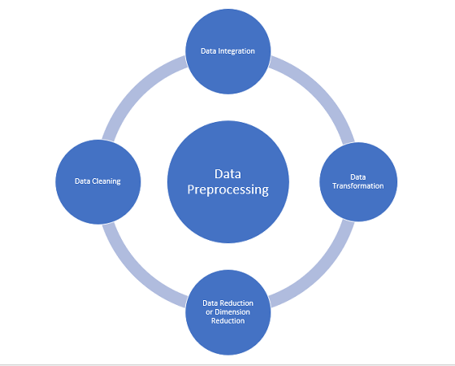
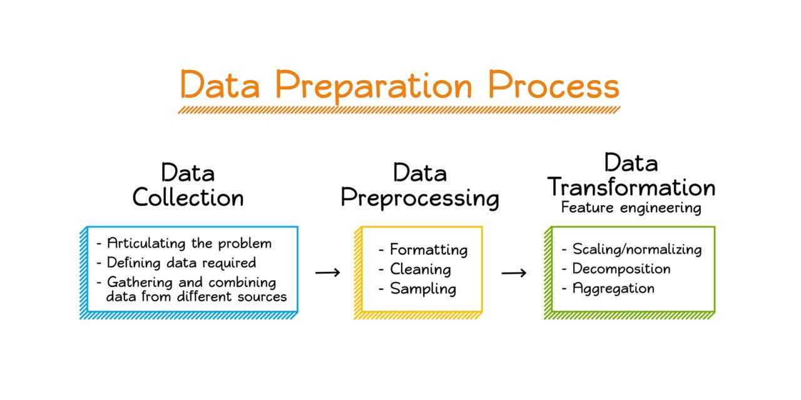
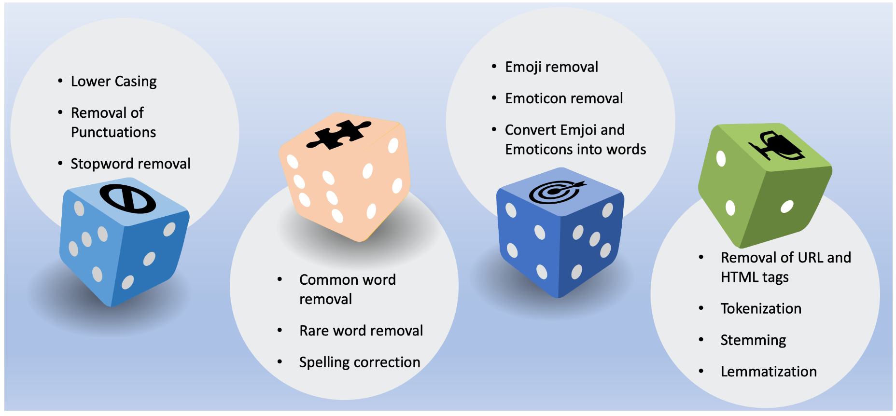
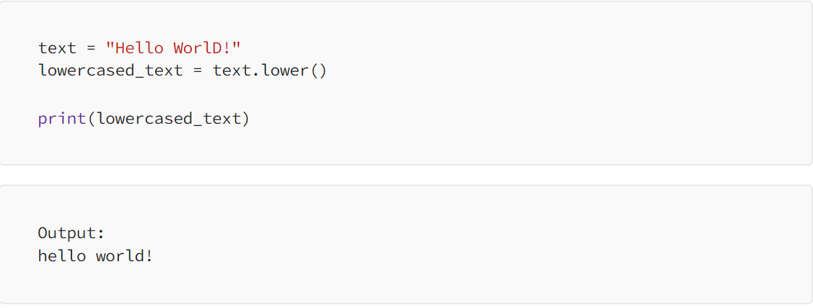
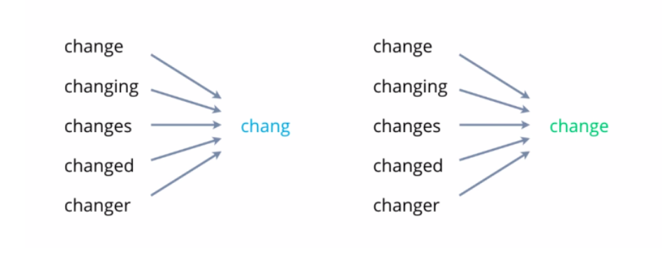
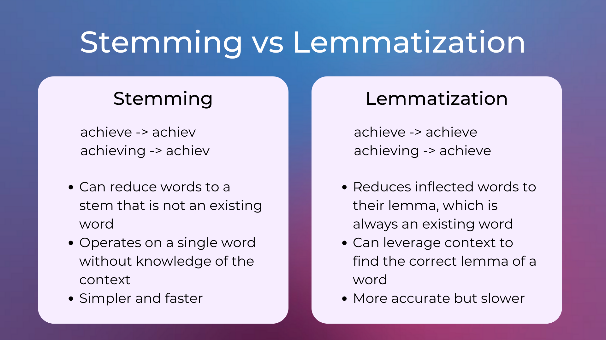

---
Hey there, this is my second journal entry on unit II, which is Data preprocessing. I hope viewers are excited to learn as I am going to explain the sub-set of this unit which include text preprocessing, it's types and image data.

### Data-preprocessing
---

Before going into actual topic, let us first understand what is data-preprocessing and it's necessarities in data-set.


Data preprocessing is a transformation of the raw data which are usually incompleteness, inconsistencies, etc into understandable and useable forms. To preprocess the data, we have to collect the data to find out the problems and defining the data requirements.

The above diagram is the preprocessing steps, that is used to convert raw data into understandable form to achieve greater accuracy.

### Necessarities of Data preprocessing
Data preprocessing is crucial for Machine Learning because;



1. Essential to handle the missing values
2. Cleans and organize the data
3. Dimensionality Reduction
4. Handling Imbalanced Data which results in improve model performance.
5. Creating new features from existing ones or extracting relevant information from unstructured data, as it improves prediction of machine learning models.
6. Scaling and Normalization ensure that all features contribute equally to the model's learning process.

### Text preprocessing

 Is a subset of data preprocessing that specifically deals with  text data. 
 It helps clean up and transform the unstructured text data into a more organized and structured format. This organized data can then be used to effectively train machine learning models, leading to better results.

 ### Text Preprocessing Techniques
 

 ### Lowercasing
 ---
 Lowercasing is a text preprocessing step where all letters in the text are converted to lowercase.

This step is important because the algorithm does not treat same words differently.

### Removing Punctuation
---
Removing punctuation marks is part of text preprocessing. In this step, you take out all the symbols like periods, commas, exclamation marks, and emojis from the text. This makes the text simpler and helps focus only on the words.
```
text = "Hello, world! This is?* 💜an&/|~^+%'\" example- of text preprocessing."
```
After text preprocessing;
```
Hello world This is an example of text preprocessing
```

### Removal of stopwords
---
It is a preprocessing steps that removes unwanted words("the", "a", "is", "and") and focus on the important, meaningful words.It doesn't change the meaning of the sentence.
```
en_text = "This is a sample sentence and we are going to remove the stopwords from this"
remove_stopwords(en_text, "english")
```
After preprocessing;
```
english
['This', 'sample', 'sentence', 'going', 'remove', 'stopwords']
```

### Removal of URLs
---
By it's name, we know that it is to remove any URLs present in the data.

```
text = "I hope it will be a useful article for you. Follow me: https://medium.com/@ayselaydin"
```
Output;
```
I hope it will be a useful article for you. Follow me:
```

### Stemming and lemmatization
Stemming and lemmatization are two text preprocessing techniques used to reduce words to their base or root form. The primary goal of these techniques is to reduce the number of unique words in a text document, making it easier to analyze and understand.



DIfferences between Stemming and lemmatization:


