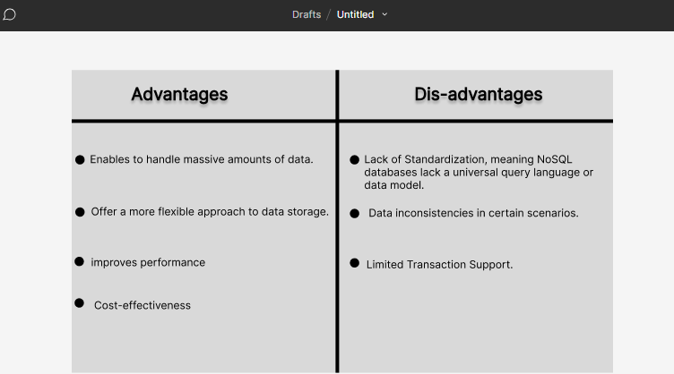

### What I learned during flipped class!
---
Kuzu zangpola! Here's another journal entry on what I learned in Flipped Class, Day six. Today I will explain the concept of NoSQL database and it's types. Without any further, let's get started.

### NoSQL Database
---
Without going into deep, firstly, let us understand what database and NoSQL are, database is a collection of structured data or information which is stored in a computer system and can be accessed easily.

NoSQL is a non-relational database that is used to store the data in the nontabular form.
NoSQL databases are a type of database management system that stores and retrieves data in a way that is different from traditional relational databases ( MySQL, PostgreSQL, etc.).

#### Advantage and Disadvantages of NoSQL Databases ;



### Types of NoSQL Database
---
1. Document-based databases
2. Key-value stores
3. Column-oriented databases
4. Graph-based databases
5. Vector Databases
6. Time-series Databases

Let us understand each one of them in detail.

### Document-based databases
---
It is a nonrelational database, which store data in flexible, semi-structured documents(JSON, BSON, or XML documents.)

Key features of document databases are their flexible schema, faster creation and maintenance, absence of foreign keys, and the use of open formats like XML and JSON to build documents. 
```
{
   "_id": ObjectId("11910002347"),
   "name": "Tenzin Namgay",
   "email": "Tenzey@gmail.com",
   "address": {
      "street": "123 Main St",
      "city": "Thimphu",
      "state": "CA",
      "zip": "12345"
   },
   "interests": ["reading", "hiking", "photography"]
}
```

The above is the example of document-based database which stores data in flexible, JSON-like documents with dynamic schemas. It is designed to be scalable, high-performance, and easy to use.


### Key-value stores
---
 key-value databases or key-value stores, are a type of non-relational database that stores data as a collection of key-value pairs. It is the simplest form of a NoSQL database.
 In this data model, each data element is associated with a unique key and the values can be simple data types like strings and numbers or complex objects.

 Key-value stores are designed to be highly scalable  and efficient for simple read and write operations. They are  fast access to data.

 ```
 SET user:1234 '{"name": "Dawa Zam", "email": "Zam@gmail.com"}'
GET user:1234
```
the above example supports a wide range of data structures, including strings, hashes, lists, sets, and more.

###


 


