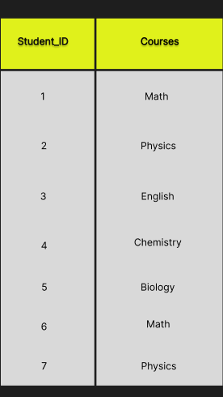
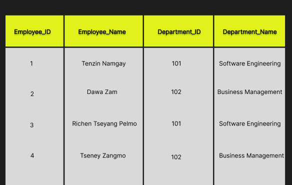
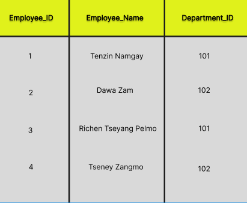
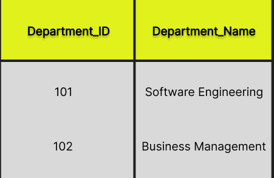
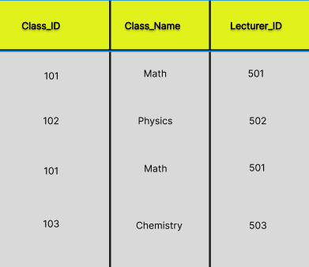
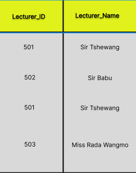
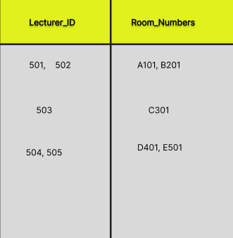

### What I learned during flipped class!
---

Hello there! Here's another journal entry on what I learned in Flipped Class, Day Five. Today, let's try to understand what normalization in DBMS is, it's importance and types. Without any further, let's get started.

### Normalization in DBMS
---
It is a technique which can organize the data in the database tables. The data is organized by breaking down the tables into smaller ones, which removes duplicate data and set up the relationship between tables.

With the above understanding, let us talk about it's importance. When the data is organized using the above technique, it:

1. Helps to reduce data redundancy and inconsistency in the database.

2. Helps in keeping data consistent.

3. More efficient storage and improved data integrity.

4. Makes the database structure, more scalable and adaptable.

### Types of Normalization in DBMS
---

There are six types of normalization in DBMS, but we only learned five, which are:

1. First Normal Form
2. Second Normal Form
3. Third Normal Form
4. BCNF
5. Fourth Normal Form

I will explain each of them with example.

### First Normal Form(1NF)
---
It is designed to eliminate repeating groups of data within a table. table is in First Normal Form if it satisfies the following conditions:

1. No Multi-Valued Attributes.
2. All the columns in a table should have unique names.
3. The primary key should consist of a single attribute.

#### Example:
Consider a table named "Students" that stores information about students and their courses:

The above table doesn't satisfies 1NF conditions because it contains multiple values (a list of courses) within a single cell. 

To bring this table into First Normal Form, we need to separate the courses into a new table and make  relationship between the Students and Courses tables.

After normalization, the tables would look like this:
#### Students Table (1NF):

#### Courses Table:

### Second Normal Form
---
 Next level of database normalization after First Normal Form (1NF), 2NF eliminate partial dependencies, which can lead to data redundancy. A table is said to be in Second Normal Form if it satisfies the following conditions:

 1. It should be in the First Normal form.
 2. No Partial Dependencies : no non-key attribute should depend only on a part of the primary key.

 #### Example:

Consider a table called "Employees" that stores information about employees and their departments:

In this table, the primary key is Employee_ID. However, the Department_Name column is partially dependent on Department_ID instead of the entire primary key (Employee_ID). This doesn't satisfies 2NF condition because Department_Name is not fully dependent on the primary key.

To make the table into Second Normal Form, we need to separate the department information into a new table and make relationship between the Employees and Departments tables.

After normalization, the tables would look like this:
#### Employees Table (2NF):

#### Departments Table:

### Third Normal Form
---
Next level of database normalization after Second Normal Form (2NF),3NF eliminate transitive dependencies. A table is said to be in Third Normal Form if it satisfies the following conditions:

1. It is in Second Normal Form
2. No Transitive Dependencies : No non-key attribute should be dependent on another non-key attribute. 

#### Example:
Consider a table called "Students" that stores information about students, their classes, and the instructors teaching those classes:

In this table, the primary key could be a combination of Student_ID and Class_ID. But, there is a transitive dependency present, the Instructor_Name column depends on Instructor_ID, which depends on Class_ID (a non-key attribute).This doesn't satisfies 3NF condition , as non-key attributes should not depend on other non-key attributes.

To convert the table into Third Normal Form, we need to separate the instructor information into a new table and establish relationships between the Students, Classes and Instructors tables.

After normalization, the tables would look like this:

#### Students Table (3NF):

#### Classes Table:

#### Instructors Table:

By separating the data into three tables based on their respective keys with no transitive dependency, we reduce data redundancy and maintain data integrity and consistency.

### Boyce-Codd Normal Form (BCNF)
---
Higher version of the Third Normal Form. BCNF removes all remaining anomalies that may still exist in a table even after satisfying the Third Normal Form. A table is said to be in Boyce-Codd Normal Form if it satisfies the following conditions:

1. It is in Third Normal Form.
2. Every Determinant is a Candidate Key: for each functional dependency ( X → Y ), X should be a Super Key.

#### Example:

The above table violates the Boyce-Codd Normal Form because the Department_Name attribute is determined by the Department_ID, but Department_ID is not a candidate key.

To bring the table into Boyce-Codd Normal Form, we can create two separate tables:

#### Employees Table (BCNF):

#### Departments Table (BCNF):

Now, every determinant (Department_ID) is a candidate key in its respective table, satisfying the Boyce-Codd Normal Form requirements.

### Fourth Normal Form
---
The main objective of 4NF is to eliminate multi-valued dependencies. A table is said to be in Fourth Normal Form if it satisfies the following conditions:
1. It is in Boyce-Codd Normal Form.
2. No Multi-Valued Dependencies.

#### Example:
Consider a table called "Courses" that stores information about courses offered by a university, the instructors teaching those courses, and the rooms where they are taught:

In this table, there is a multi-valued dependency between Course_ID and Instructor_IDs, as well as between Course_ID and Room_Numbers. A single course can have multiple instructors and can be taught in multiple rooms.

To bring the table into Fourth Normal Form, we need to separate the instructor and room information into new tables and establish relationships between the Courses, Instructors and Rooms tables.

After normalization, the tables would look like this:

#### Courses Table (4NF):

#### Course_Instructors Table:

#### Course_Rooms Table:

By separating the data into multiple tables and eliminating the multi-valued dependencies, we reduce data redundancy. ensuring the highest level of data integrity and consistency.

### What I did in flipped class!
---
During the Flipped Class session, we focused on the topic of Normal Forms in database management systems. The session began with the lecturer providing instructions for the group formation and activities. We were divided into four groups, each consisting of 6-7 students, and were assigned specific topics related to Normal Forms.

My group, Group 2, was tasked with studying and presenting on the Boyce-Codd Normal Form (BCNF).We had 30 minutes to discuss and understand the concepts, find examples, and prepare our presentation.

Within our group, we discussed the BCNF and it's condition. We looked at examples where tables did not follow BCNF and discussed how to break them into smaller tables to remove any  dependencies to follow BCNF. 

After our group discussions, one of us presented our examples and explanations for BCNF to the whole class for 20 minutes. The other group members added more information and clarifications. Throughout the Flipped Class, we actively asked questions and shared our understanding with the lecturer and other groups. The group work and presentations helped us better understand Normal Forms, especially BCNF.

### Feed-back 
---
Overall, the Flipped Class was a good way for me to learn by working together in groups and giving presentations. I practiced using what I learned about Normal Forms through group discussions and presentations. This way of learning helped me understand the topic better.

