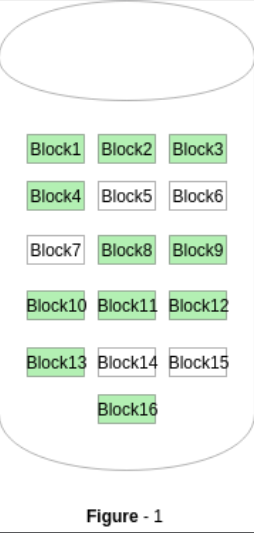
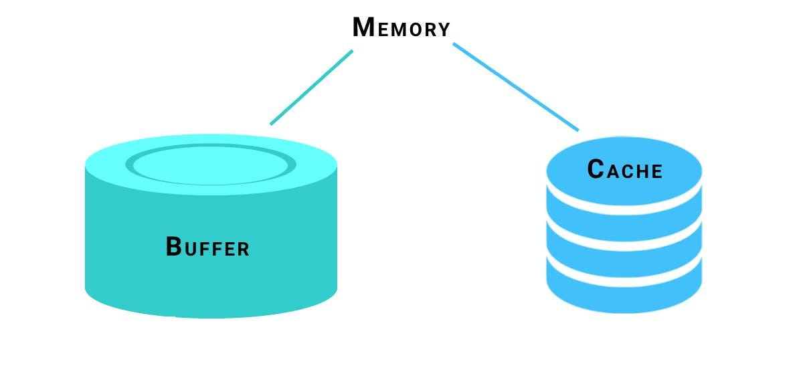

## Database Storage Structures and Buffer Management
Hello there! Today, this seventh journal explores the concepts of disk block management, RAID configurations, and buffer pool management, which are fundamental components of database storage structures.

Not only that, it also covers building a simple relational database System from scratch, which I will explain after the components of database storage structures. Without any delay, let's get started.

---

###  disk block management
Disk blocks are the basic units used to store data on hard disks. It is used to read a file or write data to a file.

### RAID (Redundant Array of Independent Disks)
RAID (Redundant Array of Independent Disks) is a technology that combines multiple physical disk drives into a single logical unit, providing data redundancy and improved performance or is a way of storing the same data in different places on multiple hard disks or solid-state drives (SSDs). 
This is done in-order to protect data in the case of a drive failure. 

The keyword for the RAID is:
1. stripping: sharing data across multiple disks
2. mirroring: duplicate the storage of data.

### Buffer Pool Management
A database buffer pool is a cache in a database management system (DBMS) that stores frequently accessed data in memory, allowing quicker access.

It is responsible for moving physical pages back and forth from main memory to disk. It allows a DBMS to support databases that are larger than the amount of memory that is available to the system.

## Building a Simple Relational Database System from scratch

Building a simple relational database system from scratch refers to the process of creating a basic database management system (DBMS) that can store, insert, deleted and retrieve data using the relational model. 

The relational model is a way of organizing data into tables (relations) with rows (records) and columns (attributes).

Now with the above understanding, let us go through some important procedures to be followed when building a relational database from scractch.

### important procedures for building a relational database from scractch.
---

 1. Define Requirements  : Understand what the       database is for and what information it needs to store.

2. Logical Design : Plan out the structure of the database, including tables and how they relate to each other.

3. Database Implementation: create the database using plan and set up the rules for how it works.

4. Security Setup:  Implement security measures to protect the database from unauthorized access.

5. Backup and Recovery Planning: Have a plan on making regular backups to prevent data-loss.

6. Maintenance and Optimization: Check database over time to make sure it keeps working well and make improvements.

### Data Structure Used
---

#### B-trees
A B-tree or balanced tree, is a way to neatly organize and efficiently accessing large amounts of data. It is important in relational databases because of their efficiency in performing operations such as insert, update, find, and delete. 

#### API
APIs are essential components of relational databases because it facilitate data access, integration, security, performance optimization, scalability, and extensibility. 

#### Database Machine (DBM) 
Database Machine plays important  role in relational database. It comes with a bunch of steps (both simple and more advanced) for changing the database. 

#### SQL Compiler
 SQL Compiler is an important component of relational database systems that processes, optimizes, and executes SQL queries efficiently.

 #### Shell
 The shell is like the control center for relational databases.It helps in managing, manipulating, and interacting with data stored in the database.