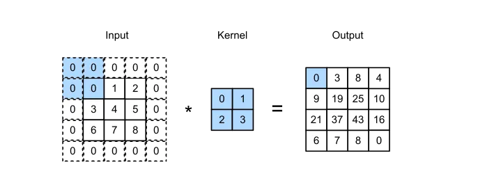
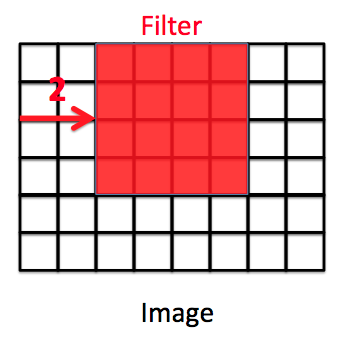
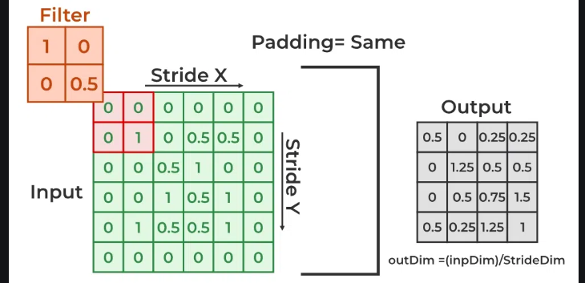
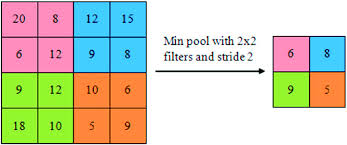
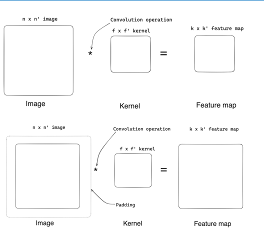

---
Hey there, this is my third journal entry on Unit III, which is Convolutional Neural Networks. I hope those who are viewing my journal are excited to learn, as I am going to give a brief explanation on this particular unit. Without any further delay, let's get started.

## Convolutional Neural Network
---

 In deep learning, a convolutional neural network (CNN) is a class of deep neural networks, most commonly applied to analyze visual data like images or videos. Now when we think of a neural network we think about matrix multiplications, the key idea behind CNNs is to use small filters or kernels that scan across the input image, extracting features at different locations. I will briefly explain about filters when I reach the kernel, which I will explain later.

 .png>)

 CNNs typically consist of multiple layers, including convolutional layers (which apply the filters), pooling layers (which downsample the feature maps), and fully-connected layers . This architecture enables CNNs to capture both low-level and high-level features, making them highly effective for tasks like image classification.

 ## Kernals
 Kernals also known as filters are the small matrices used for the convolution operation. The kernels move over the input data, multiplying their values with the corresponding pixel values in the input. This process creates a feature map which is a output that highlights features present in the input.

### Different Kernals
 In CNNs, different kernels (also called filters) are used to detect and extract various features from the input data. Each kernel is designed to identify and respond to specific patterns or features in the input. In simplier terms from my understanding  "Different kernels represent different meaningful patterns such as edges, textures, or more complex structures".

For example common karnals that I know are:

1. Sharpen to enhance the depth of edges.

2. Gaussian blur to smoothen the image before processing
3. Edge Detection is good at detecting edges and corners.

###  Terminologies 

1. Kernal-size : The size of a kernel depends on the size of the input image. Kernels are usually square-shaped, with their size written as (M×M), where M is the same number for both sides. When the kernel moves over the input data, They move from left to right and top to bottom over the input image.

.png>)

2. Stride : A stride value determines how many pixels the kernel moves each time. A stride of 2 means the kernel slides two pixels at a time. 

3. Padding : Padding is simply a process of adding layers of zeros to input images. It prevents the shrinking of the input image.

4. Input Channels : For color images, the input has three separate channels(red, green and blue). For black and white (grayscale) images, there is only one channel. The number of channels in the input determines how deep or thick the input data is.

5. Output Channels/Feature Maps: This is the number of different outputs created by using a different kernel or filter on the input.

## Pooling
Pooling layers are used to reduce the dimensions of the feature maps.

#### Types of pooling;

1. Max-pooling : Max pooling is a pooling operation that selects the maximum element from the region of the feature map covered by the filter. 

2. Min-pooling : It is the opposite of max-pooling where, pooling operation selects minimum element from the region of the feature map covered by the filter. 

3. Average Pooling : Average pooling computes the average of the elements present in the region of feature map covered by the filter.

The  outcome of pooling is thT feature maps from the convolutional layers are downsampled.

## Valid v/s Same Convolution

#### Valid Convolution;
1. Applies convolution without padding
2. Dimensions of feature map after valid convolution:
k = n - f + 1 and
k' = n - f + 1
Where n is input size, f is kernel size, k and k' are output feature map dimensions

#### Same Convolution:
1. Applies padding to keep output feature map size same as input.
2. Padding formula:
k = n + 2p - f + 1
k' = n + 2p - f + 1
Where p is the padding amount needed to retain input size after convolution

In summary, valid convolution reduces output size without padding, while same convolution pads input to maintain the spatial dimensions after convolution.

#### Summary of Convolution:
Considering stride, kernel dimensions, input dimensions, and padding, the basic convolution concepts are summarized by:

n x n' - Input image dimensions

f x f' - Kernel dimensions

k x k' - Output feature map dimensions

p - Padding amount

s - Stride value

Output feature map dimension formulas:
k = (n + 2p - f + 1) / s
k' = (n' + 2p - f' + 1) / s
The formulas combine input size, kernel size, padding, and stride to calculate the output feature map dimensions after the convolution operation.

 