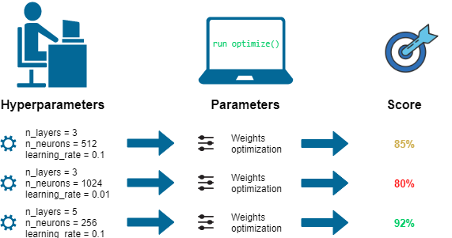
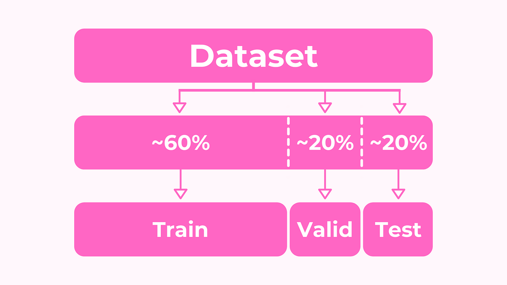
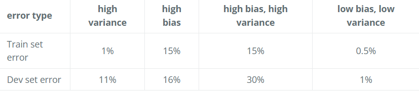
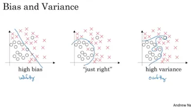

Acknowledgement
---
Hello there, here is another journal entry on the topic Hyperparameter, Regularizqtion and optimization. Before diving in, make sure you're comfortable with basic concepts like Linear Regression, Logistic Regression, Back Propagation, The Perceptron Model, and other Neural Network fundamentals. So without wasting time let's get started.

Deep Neural Networks: Hyper Parameter tuning, Regularization and Optimization
---
In the world of Deep Learning, becoming an expert in tweaking hyperparameters, applying regularization techniques, and optimizing the learning process is key to building powerful neural networks. Hyperparameter tuning involves adjusting settings like learning rate, batch size, and layer configurations before training begins to achieve the best performance. Regularization methods, such as L2 Regularization, Dropout, and Early Stopping, prevent overfitting and ensure that the model can handle new data well. Optimization techniques, like various Gradient Descent variants (SGD, Mini-batch GD, Adam, RMSprop) and Learning Rate Schedulers, focus on minimizing the loss function to improve model accuracy. 

### Let's explore the practical side of Deep Learning.

#### Train/Test/Dev sets

Setting up the training, development (dev, also called validate set) and test sets has a huge impact on productivity. It is important to choose the dev and test sets from the same distribution and it must be taken randomly from all the data.

Hyperparameters are additional parameters that influence how our algorithm operates. They include ;

1. Learning rate.

2. Number of iterations.

3. Number of hidden layers L.

4. Number of hidden units n.

5. Choice of activation functions.

Data splitting is crucial for effective model training and evaluation. It involves dividing the dataset into three parts:

1.  Training set.
2. Hold-out cross validation set / Development or “Dev” set.
3. Testing set

The training set is used to build the model, while the dev set helps optimize hyperparameters. Once the model is ready, it's evaluated on the testing set to gauge its performance.

#### Bias / Variance

When we talk about prediction models, we're interested in two main types of errors: 
1. bias and 
2. variance.

Bias is like the error that comes from simplifying things too much, while variance is the error from being too sensitive to small fluctuations in the data. 

1. If your model is under-fitting (logistic regression of nonlinear data) it has a “high bias”.

2. If your model is over-fitting, then it has a “high variance”.

This picture shows how bias and variance affect decision boundaries in different scenarios.

#### Hyperparameter Optimization Techniques

In the ML world, there are many Hyperparameter optimization techniques are available.

1. Manual Search : In manual search, hyperparameters are selected based on intuition, prior knowledge, or trial and error. This method involves manually tweaking hyperparameters and observing the model's performance until satisfactory results are achieved. 

2. Random Search : Random search involves randomly selecting hyperparameter values from predefined ranges and evaluating their performance. It is more efficient than manual search and is particularly useful when the hyperparameter space is large and complex.

3. Grid Search : Grid search involves defining a grid of hyperparameter values and exhaustively searching all possible combinations within the grid. Each combination is evaluated using cross-validation, and the hyperparameter set that yields the best performance is selected.

There are many techniques but I will keep only three.

Regularization
---
Regularization techniques are used to prevent overfitting, which occurs when a model learns to perform well on the training data but fails to generalize to unseen data. Common regularization methods include:

1. L2 Regularization (Ridge Regression): It adds a penalty term to the model's loss function that discourages large weights. This helps to prevent the model from becoming too complex and overfitting by encouraging it to use smaller weights.

1. L1 Regularization (Lasso Regression): Similar to L2 regularization, but instead of penalizing large weights directly, it penalizes the absolute values of the weights. This encourages the model to use fewer features, promoting sparsity.

3. Dropout: During training, it randomly deactivates some neurons in the neural network. This forces the network to learn more robust features by not relying too much on any single neuron, reducing overfitting.

4. Early Stopping: It halts the training process when the performance of the model on a validation set starts to worsen. This prevents the model from overfitting to the training data and becoming less effective on new, unseen data.

Optimization
---
Optimization techniques are used to minimize the loss function, making the model more accurate. Key optimization methods include:

1. Gradient Descent Variants: These are methods to adjust the model's parameters to reduce errors. They include techniques like Stochastic Gradient Descent (SGD), Mini-batch Gradient Descent, Adam, and RMSprop.

2. Learning Rate Scheduling: It's like adjusting how big of steps you take while trying to find the lowest point in a valley. This helps the process converge faster and avoid overshooting the best solution.

3. Momentum: In gradient descent, we update the model's parameters based on the slope of the loss function. Momentum adds a factor of the previous parameter update to the current update. 

4. Adaptive Learning Rates (Adam and RMSprop):  They adjust learning rates for each parameter based on gradient history, allowing larger steps in steep directions and smaller steps in gentle ones, which accelerates convergence.

These techniques are important for making deep learning models more reliable, preventing them from getting too specialized on the training data, and making them train faster.

