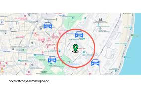
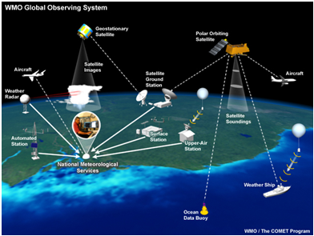
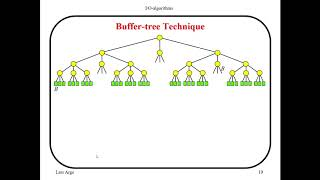

## What I learned during flipped class!

Hello there! After a long time, here's another journal entry on what I learned in Flipped Class 8. Today, I will provide information on what I have learned during the flipped class, which covers different types of indexing techniques used in databases or data management systems. The topics that I will briefly explain are Indexing of Spatial and Temporal Data, Bitmap Indices, and Buffer Tree. Without wasting any time, let's go ahead and understand them.

### Bitmap Indices
---
Bitmap Indexing is a data indexing technique which improve the performance of read-only queries that involve large datasets. It is a data structure that represents the presence or absence of data values in a table or column.

In a bitmap index, each distinct value in a column is assigned a bit vector( array data structure that compactly stores bits). That represents the presence or absence of that value in each row of the table.

#### Key-words
1. bit vector - contains one bit for each row in the table.
2. set bit - indicates the presence of the corresponding value in the row.
3. cleared bit - indicates the absence of the value.

Bitmap indexes can be particularly useful when you have columns with low cardinality (a small number of distinct values) or when you frequently run queries that involve logical operations like AND, OR, and NOT on specific column values.

#### Features of Bitmap Indexing:
---

 1. Space efficiency : 
 Compact binary representation for storing data, useful for large datasets with many attributes.

 2. Fast query processing:
  Efficient for complex queries involving multiple attributes using set-based operations (AND, OR, NOT).

 3. Flexibility : 
 Suitable for numerical, categorical, and text data types.

 #### Applications of Bitmap Indexing:
 ---
1. Fast queries on large datasets:
  Bitwise operations on bitmaps accelerate query execution, especially for complex conditions.

2. Efficient range queries:
 Bitmaps for value ranges enable fast range queries on numeric or date columns.

3. Space-efficient for low-cardinality columns:
 More space-efficient than other indexing techniques for columns with few distinct values.

### How Bitmap Indexing is Done?

Imagine you have a large table with many rows and columns. One of the columns, let's say "City," contains values like "New York," "Chicago," "Los Angeles," and so on. A bitmap index is a way to represent the data in this column more efficiently.

.png>)

Let's create a bitmap index on the "City" column. For each distinct value in the "City" column, we will create a bit vector with a length equal to the number of rows in the table.

1. Bitmap for "New York":
1 0 0 1 0 0 1 0 0 0
2. Bitmap for "Chicago":
0 1 0 0 0 0 0 0 1 0
3. Bitmap for "Los Angeles":
0 0 1 0 0 0 0 0 0 0
4. Bitmap for "London":
0 0 0 0 1 0 0 0 0 0
5. Bitmap for "Paris":
0 0 0 0 0 1 0 0 0 0
6. Bitmap for "Sydney":
0 0 0 0 0 0 0 1 0 0
7. Bitmap for "Tokyo":
0 0 0 0 0 0 0 0 0 1

With these bitmap indexes, you can efficiently answer queries involving the "City" column by performing bitwise operations on the corresponding bit vectors. For example, to find all customers from "New York" or "Chicago", you can perform a bitwise OR operation on the bitmaps for "New York" and "Chicago":
.png>)

The resulting bit vector 1 1 0 1 0 0 1 0 1 0 indicates that rows 1, 2, 4, 7, and 9 satisfy the condition "City = 'New York' OR City = 'Chicago'".

The key advantage of using bitmap indexes is that they allow for very efficient querying and filtering of data, especially for read-only queries on large datasets and the disadvantage is only suitable for large tables.

### Indexing of Spatial and Temporal Data
---

Indexing spatial and temporal data means arranging geographic and time-based information in a way that makes it easy to find and use. This is important for things like maps, location services, and analyzing data that changes over time.

### Spatial Indexing:
#### Features
1. Allows efficient storage and retrieval of geographic data, such as points, lines, polygons, and complex geometries.
2. Enables spatial queries, like finding nearby objects, calculating distances, and identifying intersections or overlaps.

#### Applications
1. Geographic Information Systems (GIS): Indexing used for efficient storage, retrieval, and querying of geographic data like maps and satellite imagery.

2. Location-based services: Spatial indexing enables quickly locating nearby points of interest, calculating routes, and matching users with nearby service providers based on location.

### Temporal Indexing:
#### Features
1. Supports efficient retrieval of data within specific time ranges or intervals.
2. Organizes time-series data, such as sensor readings, stock prices, or event logs, based on their timestamps.

#### Applications
1. Time-series databases and data warehouses: Temporal indexing enables efficient storage and retrieval of large volumes of time-series data for analysis and reporting.

2. Financial data analysis: Indexing time-stamped financial data allows quick access to historical trends, price movements, and portfolio performance over different time periods.

### Spatio-Temporal Indexing:
#### Features
1. Combines spatial and temporal indexing techniques to handle data with both geographic and time components.

2. Enables queries that involve spatial and temporal constraints simultaneously.

#### Applications
1. Tracking moving objects: Spatio-temporal indexing enables efficient tracking and analysis of objects that change location over time, such as vehicles, animals, or weather systems.

2. Environmental monitoring and forecasting: Indexing environmental data with both spatial and temporal components allows for monitoring environmental changes across different geographic regions over time and forecasting future scenarios.

### When Indexing of Spatial and Temporal Data used
1. 

A ride-sharing app uses spatial indexing to efficiently match nearby drivers with customer requests based on their locations.

2. 

In a weather forecasting system, spatio-temporal indexing is used to study and predict weather patterns in various places over different periods. This helps in understanding how weather changes over time and across different areas.

### Buffer Tree
---
A Buffer Tree is a data structure used for indexing moving objects in databases, particularly in spatio-temporal databases. It is designed to handle the efficient storage, retrieval, and querying of data related to objects that change their positions over time, such as vehicles, aircraft, or mobile devices.

This technique helps reduce wasted space and makes better use of available memory by efficiently reusing buffers of different sizes as needed.

#### Features of Buffer Tree:
1. Hierarchical Structure: The Buffer Tree is a type of hierarchical data structure, similar to an R-Tree, often used as a spatial index. It arranges data into layers of nested nodes. Each node represents a specific area in space and holds information about objects or other nested nodes inside it.

2. Time-Partitioning: Along with dividing data by space, the Buffer Tree also divides data by time. Each node in the tree is linked to a specific time period. This means that the objects stored within each node are considered valid only during that associated time interval.

#### Applications of Buffer Tree:

1. Location-Based Services (LBS): Used to index real-time locations of moving vehicles (e.g., ride-sharing drivers) for efficient matching with nearby users.

2. Air Traffic Control: Efficient indexing and querying of aircraft trajectories, enabling better air traffic monitoring and management.

### Class activities
---
In our class, we focused on the topic of indexing. The lecturer divided us into groups of four students each, forming a total of six groups labeled G1 to G6. After the initial group formation, we were further split into two larger quiz groups for discussion purposes. The six smaller groups were assigned different topics related to indexing, with G1 and G4 discussing indexing of spatial and temporal data, G2 and G5 (which was my group) exploring bitmap indices, and G3 and G6 discussing buffer trees. The groups were formed by selecting random papers containing different song lyrics, and students with the same song were placed in the same group.

After that, we took 5 minutes to get into our small groups, and our lecturer had us sing the lyrics on paper, indicating that the same song lyrics were in the same group. My group then spent 25 minutes discussing and learning about bitmap indexing. After this first discussion, we joined the bigger quiz groups and continued our discussions for another 25 minutes. This allowed me to also learn about the other indexing topics like spatial/time-based indexing and buffer trees from the other groups.

Finally, we took a quiz on indexing, which lasted for 30 minutes. Throughout the class activities, I actively participated in group discussions, shared what I knew about bitmap indices, and also learned from my friends about the other indexing techniques. All this knowledge helped me during the quiz at the end.

Feed-back
---
The class activities were very entertaining and unique, which allowed me to actively participate, as there was competition between two-large groups.

