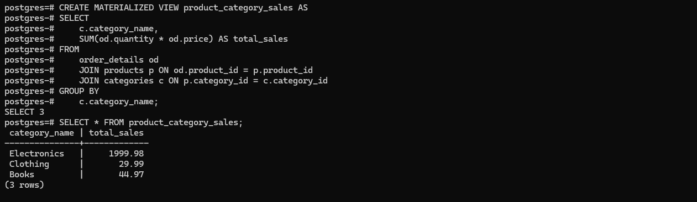
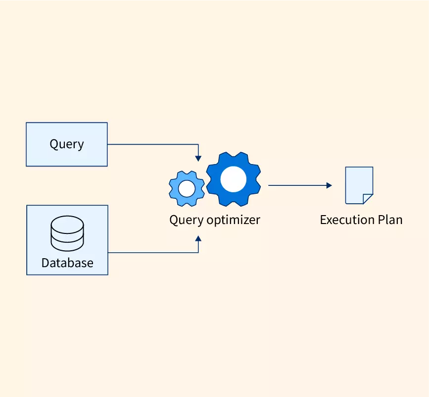

## What I learned during flipped class!

Hello there! Here's another journal entry on what I learned in Flipped Class 9. Today, I will provide information on what I have learned during the flipped class, which covers the topic Query Optimization. The topics that I will briefly explain are Materialised Views and Advanced Topics in Query Optimization. Without wasting any time, let's go ahead and understand them.

 Materialised view
---
Materialized views are special database objects that save the results of a query in a separate storage area, similar to a table.They are helpful when certain queries are run often and the results can be pre-calculated and stored for quicker access. Instead of running the complex query each time, the database can quickly retrieve the results from the materialized view, which is like a ready-made answer. 

The diagram illustrates the concept of materialized views in a database system;
.png>)

1. A SQL query is executed, and its results are stored in the database.
2. The materialized view is created by running the SQL query, taking the query's result set and storing it in a separate database object called a materialized view(similar to a table).
3. When a user wants to access the data represented by the SQL query, they can either:
a. CREATE the materialized view if it doesn't exist, which will execute the SQL query and store the results.
b. SELECT from the existing materialized view, which will return the pre-computed results much faster than running the SQL query again.

#### Example
creating the necessary tables and inserting some sample data:
```
-- Create the categories table
CREATE TABLE categories (
    category_id INT PRIMARY KEY,
    category_name VARCHAR(50)
);

-- Insert sample data into the categories table
INSERT INTO categories (category_id, category_name) VALUES
    (1, 'Electronics'),
    (2, 'Clothing'),
    (3, 'Books');

-- Create the products table
CREATE TABLE products (
    product_id INT PRIMARY KEY,
    product_name VARCHAR(100),
    category_id INT REFERENCES categories(category_id)
);

-- Insert sample data into the products table
INSERT INTO products (product_id, product_name, category_id) VALUES
    (1, 'Laptop', 1),
    (2, 'Shirt', 2),
    (3, 'Novel', 3);

-- Create the order_details table
CREATE TABLE order_details (
    order_detail_id INT PRIMARY KEY,
    product_id INT REFERENCES products(product_id),
    quantity INT,
    price DECIMAL(10, 2)
);

-- Insert sample data into the order_details table
INSERT INTO order_details (order_detail_id, product_id, quantity, price) VALUES
    (1, 1, 2, 999.99),
    (2, 2, 1, 29.99),
    (3, 3, 3, 14.99);
``` 

Runing the CREATE MATERIALIZED VIEW statement:


This will create the product_category_sales materialized view, which stores the pre-computed results of the query.

### Benefits of a Materialized View
The benefits of using materialized views in your database are;

1. Improve Query Performance : By using materialized views, it can skip several computing steps and get pre-computed results delivered directly. These pre-computed results can save time and improve query performance by maintaining the data storage.

2. Increases the speed of queries : Regular data queries can take a while, especially with large databases. Materialized views can increase the speed of queries because it keeps data pre-computed and stored so that it can get results more rapidly.

3. Simplifies optimizing data : Standard views tend to be more complex and challenging to handle, but materialized views can simplify the query process. Materialized views will keep data up to date, which can improve executive and speed up computing power.

Advanced Topics in Query Optimization
---

Query optimization is the process of finding the most efficient way to execute a query and retrieve the desired data from the database.
 

The main objectives of query optimization are:

1. Determine the optimal plan to access the database.
2. Reduce the time required to execute the query.

## Techniques

### Query Plan Analysis :
 Understanding the query plan is important for finding slow parts in your SQL queries. Most SQL databases have an EXPLAIN command or a graphical execution plan that shows how the query will run and the cost of each step.

### Avoid Negative Searches 
 Negative searches, such as those using NOT IN, NOT EXISTS, or <>, can significantly slow down query performance because they often prevent the effective use of indexes.

Example: Instead of using NOT IN for a subquery, consider rewriting the query to use a left join and filter out null values, which can be more efficient.
```
SELECT CustomerID FROM Customers
WHERE CustomerID NOT IN (SELECT CustomerID FROM Orders);
```
```
SELECT c.CustomerID
FROM Customers c
LEFT JOIN Orders o ON c.CustomerID = o.CustomerID
WHERE o.CustomerID IS NULL;
```
This rewrite allows for a more efficient execution plan, especially if CustomerID is indexed in both tables.

### Partitioning Large Tables 
 Partitioning can significantly improve performance for large tables by dividing them into smaller, more manageable pieces, based on a key.


Example: Partitioning the Orders table by OrderDate.
```
CREATE TABLE Orders
(
    OrderID int,
    OrderDate date,
    ...
) PARTITION BY RANGE (OrderDate);
```

### Selective Indexing
Highly selective columns (those with many unique values, like an ID) are good candidates, whereas columns with few unique values (like a gender column) may not benefit much from indexing.

Example: Create an index on a column only if it significantly narrows down the search results.
```
CREATE INDEX idx_customer_id ON Orders(CustomerID);
```

### Pre-filter Data Before Joins
Filtering data before a join operation can significantly reduce the amount of data processed.

Example: Consider two large tables, Orders and OrderDetails. If you're only interested in orders from the last month, filter each table on the relevant date column before joining them.

```
SELECT *
FROM (SELECT * FROM Orders WHERE OrderDate >= '2023-01-01') AS FilteredOrders
JOIN OrderDetails ON FilteredOrders.OrderID = OrderDetails.OrderID;
```

Advanced Topics
---

There are various topics which lead the query optimization to its advanced level. They are;

### Top-K Optimization
Top-K Optimization techniques are used to speed up queries only if there is the need of top K results from a sorted list. Instead of processing all the data, these techniques either sort the results as they are produced or estimate the top values early to reduce the amount of data processed. This makes the query run faster.

Here’s an example of a top-k query:
The user is interested in knowing the rows of T with the top 10 values of column a. 

Assume table T has the following data:


running the query:

```
SELECT * FROM T ORDER BY a DESC LIMIT 10
```
Results;


### Join Minimization
Join minimization is a technique that makes queries run faster by cutting out unnecessary tables or relationships from join operations. This reduces the complexity and improves the performance of the query.

Example : Let's say we have three tables: Orders, Products, and Customers. We want to retrieve the order details along with the product name, but we don't need the customer information.

Without join minimization, the query might look like this:
```
SELECT
    o.OrderID,
    o.OrderDate,
    p.ProductName,
    c.CustomerName
FROM
    Orders o
    JOIN Products p ON o.ProductID = p.ProductID
    JOIN Customers c ON o.CustomerID = c.CustomerID;

```

Results;


To minimize the join and improve query performance, we can remove the unnecessary Customers table from the join operation:
```
SELECT
    o.OrderID,
    o.OrderDate,
    p.ProductName
FROM
    Orders o
    JOIN Products p ON o.ProductID = p.ProductID;
```

Results;


This result provides the same relevant information without the unnecessary data, making the query more efficient.


Class activities
---

During the flipped class session on query optimization, the instructor first provided instructions on how the session would be structured. We then formed groups of six students each, with four groups total (G1 to G4).

I was assigned to Group 2 (G2), which focused on advanced topics in query optimization. For the first 10 minutes, our group discussed and explored various advanced concepts and techniques related to query optimization. After our initial group discussions, we reorganized into two groups: G2 and G3 together, and G1 and G4 together for quiz. In my group, we spent 10 minutes creating questions about materialized views and advanced query optimization topics. These questions will be answered by the other group later.

Finally, during the 30-minute, my group took turns answering the questions and throwing questions to other group, testing our knowledge on the two assigned topics. As part of Group 2 focusing on advanced query optimization, I contributed my understanding of advance optimization topics while also learning about materialized views from the questions posed by the other group.All this knowledge helped me during the quiz at the end.


