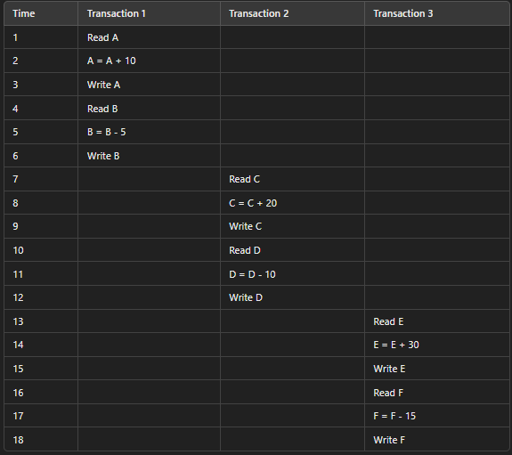
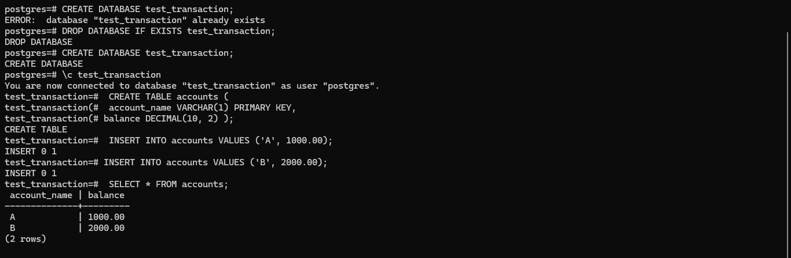
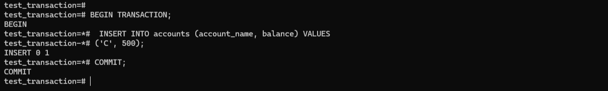

## What I learned during flipped class!


Hello there! Here's another journal entry on what I learned in Flipped Class 10. Today, I will provide information on what I have learned during the flipped class, which covers the topic of Transactions. By the end of this journal, you should be able to explain database transactions, understand the transaction model, implement transactions in databases, and understand ACID transactions. Without further delay, let's get started.


Transaction
---
A database transaction is a logical unit that generally includes several low-level steps. If one step of the transaction fails, the whole transaction fails. A database transaction is used to create, update, or retrieve data.

#### Examples

Tenzin account ;
```
Open_Account(Tenzin)
Old_Balance = A.balance
New_Balance = Old_Balance - 500
A.balance = New_Balance
Close_Account(Tenzin)
```
Yoezer account
```
Open_Account(Yoezer)
Old_Balance = B.balance
New_Balance = Old_Balance + 500
B.balance = New_Balance
Close_Account(Yoezer)
```

In the above example, bank employee transfers Rs 500 from Tenzin account to Yoezer account. This very simple and small transaction involves several low-level tasks.

### Operations of Transaction


1. Read(x) :  A read operation retrieves the value of X from the database and stores it in the main memory. This is done when a user wants to view data without changing it. For example, checking an account balance involves a read operation to get the balance from the database.

2. Write(X) : A write operation saves a value from memory to the database. First, a read operation gets the value into memory, where it's changed as needed. Then, a write operation stores the updated value back in the database. For example, when withdrawing money, the balance is read, updated, and then written back to the database.

3. Commit : A commit operation ensures that changes made by a transaction are permanently saved in the database. 

4. Rollback : Rollback is like hitting "undo" for a transaction that got interrupted by a failure. This helps avoid mistakes or confusion caused by incomplete transactions.

### Understanding Transaction

Think of a database transaction as a series of operations performed within a DBMS. The transaction system makes sure the data in the database always stays accurate and reliable.


1. If a transaction is successful, the data in the database is updated as shown in the image. This is called a “commit.”

2. If a transaction fails, If a transaction fails, all the steps done before the failure are undone. The data in the database goes back to how it was before the transaction started. This process is called a "rollback."

In other terms, a database transaction ends with a commit or rollback. This ensures that database transactions are Atomic, Consistent, Isolated, and Durable. These are commonly known as the ACID properties. Let’s learn more about them.

ACID Properties in DBMS
---
A transaction is a small part of a program that can include many simple tasks. In a database system, a transaction must follow the ACID properties Atomicity, Consistency, Isolation, and Durability to ensure the data is accurate, complete, and reliable.


1. Atomicity : Ensures that all parts of a transaction are completed successfully, or none of them are. It means a transaction can't be split up; it either happens entirely or not at all. This prevents transactions from getting stuck in the middle and stops the database from being partially updated.

2. Consistency : Any transaction leaves the database in a consistent state, regardless of the outcome of the transaction. If the database was in a consistent state before the transaction, it must remain consistent after the transaction is executed.

3. Isolation : Each transaction works with its own version of the database. Data used by a transaction that hasn't finished can't be changed by other transactions.

4. Durability : Once a transaction has been successfully completed, its effect will remain in the database even if the database fails. So, if a transaction completes but the database crashes before saving, the changes will still be there when the system is back up.

Simple Transaction Model
---
The simple transaction model follows a clear path: it starts active, moves to partially committed when it's almost done, then either commits successfully or fails and gets aborted.


1. Active − In this state, the transaction is being executed. This is the initial state of every transaction.

2. Partially Committed − When a transaction executes its final operation, it is said to be in a partially committed state.

3. Failed − A transaction is said to be in a failed state if any of the checks made by the database recovery system fails. A failed transaction can no longer proceed further.

4. Aborted − If any of the checks fails and the transaction has reached a failed state, then the recovery manager rolls back all its write operations on the database to bring the database back to its original state where it was prior to the execution of the transaction. Transactions in this state are called aborted.

5. Committed − If a transaction executes all its operations successfully, it is said to be committed. All its effects are now permanently established on the database system.


Serializability
---
When multiple transactions run at the same time in a multiprogramming environment, the steps of one transaction can mix with the steps of another.

#### Schedule 
A schedule is the order in which a transaction's steps are carried out. It can include many transactions, each with its own set of tasks.

.png>)
Schedules in DBMS are of two types:

1. In a serial schedule, transactions are executed one after another. Only one transaction runs at a time while the others wait. This keeps the database consistent because transactions don't run at the same time. 

For example, if three people need to update their bank accounts, each must wait their turn. This is very safe but slow.
```
-- Serial Schedule Example--

BEGIN;

-- Transaction 1: Namgay deposits 10000
UPDATE accounts SET balance = balance + 10000 WHERE user_id = 1;

-- Transaction 2: Dawa withdraws 5000
UPDATE accounts SET balance = balance - 5000 WHERE user_id = 2;

-- Transaction 3: User Tenzin deposits 20000
UPDATE accounts SET balance = balance + 20000 WHERE user_id = 3;

COMMIT;
```
For better understaning, refer the table below.
#### Example



In a serial schedule, each transaction waits for the previous one to finish completely.


2. In a non-serial schedule, multiple transactions start and run before any one transaction is completely finished. This reduces waiting time and improves system efficiency.

 In this example, transactions run concurrently, but you would typically use transactions with appropriate isolation levels to ensure consistency.


```
-- Non-Serial Schedule Example

-- Transaction 1: Cuney A deposits $100
BEGIN;
UPDATE accounts SET balance = balance + 100 WHERE user_id = 1;
COMMIT;

-- Transaction 2: User jackson withdraws $50
BEGIN;
UPDATE accounts SET balance = balance - 50 WHERE user_id = 2;
COMMIT;

-- Transaction 3: User Bean deposits $200
BEGIN;
UPDATE accounts SET balance = balance + 200 WHERE user_id = 3;
COMMIT;
```
For better understanding ;


In this non-serial schedule, multiple transactions execute parts of their tasks at the same time, which can be faster but requires careful handling to avoid errors and keep the database consistent.

Serializable
---
In a database, serializability is a property of a non-serial schedule that checks if it keeps the database consistent. A non-serial schedule that ensures the database remains consistent after all transactions are executed is called a serializable schedule. Serial schedules always keep the database consistent because each transaction starts only after the previous one finishes.

### Testing of Serializability
To test the serializability of a schedule, we can use Serialization Graph.

Suppose we have two transactions, T1 and T2, operating on two data items, X and Y. The schedule of operations is as follows:


To construct the serialization graph for the given schedule, we follow these steps:
1. Create vertices for each transaction (T1 and T2).
2. Add directed edges based on the order of operations on shared data items (X and Y).

Steps to Create the Serialization Graph:
---
#### Create vertices:

T1
T2

#### Add edges:

For data item X:

1. T1 reads X first, then T2 reads X: No edge because both are reads.
2. T1 writes X after T2 reads X: T1 → T2 (because T1's write occurs after T2's read).

For data item Y:

1. T2 reads Y, then writes Y: No edge because it's within the same transaction.
2. T2 writes Y before T1 reads Y: T2 → T1 (because T2's write occurs before T1's read).

#### Serialization Graph:
1. Vertices: T1, T2

2. Edges:
T1 → T2 (due to X)
T2 → T1 (due to Y)

#### Graph Representation:
```
T1 → T2
↑    ↓
T1 ← T2
```
In this graph, we have a cycle: T1 → T2 → T1. This means that the schedule is not serializable.

Types of Serializability
---

Serializability of non-serial schedules can be checked in two main ways: 
1. Conflict Serializability and
2.  View Serializability.

#### Conflicting pair in transactions

In a schedule where transactions run at the same time, conflicting pairs refer to operations that:

1. Belong to different transactions.
2. Work on the same piece of data.
3. One of them is a WRITE operation.

#### Example
 let's consider a schedule with three transactions, t1, t2, and t3, working simultaneously:

 ```
 t1: READ(X)
t2: WRITE(X)
t3: READ(X)

```
In this schedule, we have conflicting pairs:

1. t1 (READ(X)) and t2 (WRITE(X)) - they belong to different transactions, work on the same data (X), and one of them is a WRITE operation.

2. t2 (WRITE(X)) and t3 (READ(X)) - they belong to different transactions, work on the same data (X), and one of them is a WRITE operation.

 
If a schedule is conflict serializable, it's definitely consistent. However, a non-conflict serializable schedule might or might not be consistent.

#### View Equivalence
---
Two schedules would be view equivalence if the transactions in both the schedules perform similar actions in a similar manner.

For example;
1. If T reads the initial data in S1, then it also reads the initial data in S2.

2. If T reads the value written by J in S1, then it also reads the value written by J in S2.
3. If T performs the final write on the data value in S1, then it also performs the final write on the data value in S2.

Class activities
---
During class activites, We explored transaction states and their ACID properties by getting hands-on with SQL exercises.

Firstly, Let’s do this transaction in Postgresql.


1. It creates a new database named "test_transaction".
2. It connects to the "test_transaction" database.
3. A table named "accounts" is created with columns for "account_name" (VARCHAR) and "balance" (DECIMAL).
4.  It inserts two rows into the "accounts" table, one for account 'A' with a balance of $1000.00, and another for account 'B' with a balance of $2000.00.
5. Finally, it selects and displays all rows from the "accounts" table, showing the account names and their respective balances.


1. A transaction is started.
2. The balance of account 'A' is decreased by $500.
3. The balance of account 'B' is increased by $500.
4. The transaction is committed, making the changes permanent.
5. All rows from the "accounts" table are selected and displayed, showing the updated balances for both accounts.
---

####  Active

In this code, we're starting a transaction and updating the "accounts" table. Specifically, we're reducing the balance of account 'A' by $100. At this stage, the changes are made to the data, but they're not permanently saved in the database yet. 

#### Partially Committed

In this code, we're adding a new record to the "accounts" table for account 'C' with a balance of $500. After this, we use the commit operation to permanently save the changes to the database. If everything goes smoothly, the transaction enters the Committed state, and the changes are saved. If there's an error, the transaction enters a failed state.

#### Failed

In this situation, we're starting a transaction and decreasing the balance of account 'C' by $50. But, to mimic an error, we're canceling the transaction, undoing any changes made.

#### Aborted

If the error isn't resolved in the failed state, the transaction is aborted. A rollback operation is executed to restore the database to its last saved consistent state. 


####  Commited

This indicates the successful completion of the transaction.


### Conclusion
---

In conclusion, database transactions are essential for maintaining data integrity and reliability. By following the ACID properties - Atomicity, Consistency, Isolation, and Durability, transactions guarantee that data remains accurate and complete, even in the face of errors or system failures. Through practical exercises in SQL, we together explored transaction states and their properties, gaining a deeper understanding of how transactions work within a database management system.


