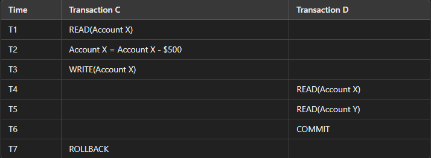
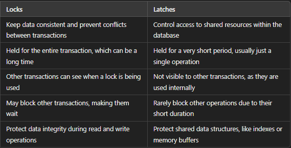

## What I learned during flipped class!

Hello there! Here’s another journal entry on my learnings from Flipped Class 11. In this session, we explored the topic of concurrency control. By the end of this journal, you should grasp the significance of locks in concurrency control, know how to implement locks in database transactions, and be able to analyze different concurrency control schemes. Let’s dive in.

What is concurrency control in DBMS?
---
A transaction is a single unit of work that can get or change data in a database. Running each transaction one by one makes other transactions wait longer and slows down the overall process.  Hence, to make things faster and to reduce the waiting time, transactions are executed concurrently.


#### To give an example for better understanding;

Let's say we have two transactions, T1 and T2, running concurrently in a banking system.
```
Transaction T1:

1. begin trans
2. op1.1: Retrieve account balance for Account A
3. op1.2: Deduct $500 from Account A
4. commit

Transaction T2:

1. begin trans
2. op2.1: Retrieve account balance for Account B
3. op2.2: Deposit $300 into Account B
4. commit

Instead of executing these transactions one after the other (serially), the DBMS allows them to run concurrently by interleaving their operations:
op1.1 (Retrieve balance for A)
op2.1 (Retrieve balance for B)
op2.2 (Deposit $300 into B)
op1.2 (Deduct $500 from A)
```
By running T1 and T2 concurrently, the overall time for both transactions to complete is reduced compared to running them serially (one after the other). 

Concurrency Control Problems
---
There are several problems that arise when numerous transactions are executed simultaneously in a random manner. These problems are referred to as Concurrency Control Problems. Some specific problems include:


#### The dirty read problem
 in a database happens when a transaction reads data that has been updated by another transaction that hasn't finished yet. 

 #### Examples :
  Consider two transactions T1 and T2 operating on a data item X in the database. The initial value of X is 100.
  ```
  Transactions Overview:
1. Transaction C: Transfers $500 from Account X to Account Y.
2. Transaction D: Reads the balance of Account X and Account Y for auditing purposes.


Initial Balance:
Account X: $2000
Account Y: $3000
```



1. At T1: Transaction C reads the balance of Account X, which is $2000.

2. At T2: Transaction C deducts $500 from Account X, making it $1500, but this change is still in the temporary buffer.

3. At T3: Transaction C writes the new balance of $1500 to Account X in the temporary buffer (not yet committed).

4. At T4: Transaction D reads the balance of Account X, seeing it as $1500.

5. At T5: Transaction D reads the balance of Account Y, which is still $3000.

6. At T6: Transaction D commits, thus using the balances it read.

7. At T7: Transaction C encounters an error and performs a rollback, reverting the balance of Account X back to $2000.

This scenario shows the dirty read problem. Transaction D reads an update from Transaction C that hasn't been finalized yet.

#### Lost Update Problem
When two transactions try to update the same data at the same time, one update can overwrite the other, leading to the loss of data integrity.

#### Examples ;

Consider two transactions, Transaction E and Transaction F, both trying to update the quantity of an item in an online shopping cart.
```
Initial Quantity:
Item Quantity: 10

Transactions Overview:
1. Transaction E: Increases the quantity by 5.
2. Transaction F: Decreases the quantity by 3.
```


1. At T1: Transaction E reads the quantity of the item as 10.

2. At T2: Transaction F reads the same quantity of 10.

3. At T3: Transaction E calculates the new quantity as 15 (10 + 5).

4. At T4: Transaction F calculates the new quantity as 7 (10 - 3).

5. At T5: Transaction E writes the new quantity of 15 to the database.

6. At T6: Transaction F writes the new quantity of 7 to the database, overwriting the update made by Transaction E.

This example shows the lost update problem, where two updates happen at the same time, and one update overwrites the other, causing the data to be wrong.

Concurrency Control Protocols
---
Concurrency control protocols are the set of rules which are maintained in order to solve the concurrency control problems in the database mentioned above. It can be broadly divided into two categories :

1. Lock based protocols
2. Time stamp based protocols

###  Lock based protocols
To attain consistency, isolation between the transactions is the most important tool. Isolation is achieved if we disable the transaction to perform a read/write operation. This is known as locking an operation in a transaction.
From my understanding,  Lock-based protocols let us control which actions can happen at the same time by locking the ones we don't want to interfere with.


#### Two kinds of locks used in Lock-based protocols:
1. Shared Lock(S):  Shared lock is also known as read lock which allows multiple transactions to read the data simultaneously. The transaction can only read the data item but it cannot modify the data item.

2. Exclusive Lock : Exclusive lock is also known as the write lock. Exclusive lock allows a transaction to update a data item. Only one transaction can hold the exclusive lock on a data item at a time.


#### The lock compatibility matrix :


1. Shared lock is compatible with Shared lock : Multiple transactions can hold shared locks on the same resource for read operations.

2. Shared lock is not compatible with Exclusive lock : If a transaction holds an exclusive lock on a resource, no other transaction can acquire a shared lock on the same resource, and vice versa.

3. Exclusive lock is not compatible with Shared lock : If a transaction holds a shared lock on a resource, no other transaction can acquire an exclusive lock on the same resource.

4. Exclusive lock is not compatible with Exclusive lock : Only one transaction can hold an exclusive lock on a resource at a time.

### Two phase locking
This locking protocol divides a transaction's execution into three phases. First, it requests the necessary locks. Then, it acquires these locks. Once it releases its first lock, the third phase begins, during which the transaction can't request new locks, only release existing ones. This method ensures transactions handle locks systematically.


Two-phase locking has two phases;
1. one is growing : where all the locks are being acquired by the transaction and,
2. shrinking : where the locks held by the transaction are being released.


### Latches
Latches are like simple, fast locks that databases use to control access to shared stuff, such as data structures or memory spaces. They are designed to be quickly locked and unlocked, usually very fast, making them perfect for handling things that need to be accessed a lot in a database.

Latches help ensure data consistency and prevent conflicts that can arise from concurrent access by multiple transactions or threads.

#### Differences Between Locks and Latches



Time-based Protocols
---

This protocol timestamps each transaction to note when it enters the system. Additionally, every transaction is tagged with read and write timestamps, showing the most recent read and write actions. 


### Timestamp Ordering Protocol:

The timestamp-ordering protocol maintains serializability by arranging conflicting read and write operations based on transaction timestamps. This ensures that tasks are executed in accordance with the timestamp values, ensuring proper sequencing and consistency.

#### Examples ; 

In this above example:

1. Transaction A performs a write operation with a timestamp of 10.
Then, 
2. Transaction B performs a write operation with a timestamp of 12.
3. Transaction B reads the value it wrote, so it has a read operation with a timestamp of 12.
4. Transaction A reads the value written by Transaction B, but since Transaction A's timestamp (15) is greater than Transaction B's timestamp (12), the ordering is consistent, ensuring correct serialization.


### Rules for Read and Write Operations in Timestamp Ordering Protocol.


In the timestamp ordering protocol:

#### Read Operations:

1. If Transaction A's timestamp (TS(A)) is less than the write timestamp (W-timestamp(DT)) of the data item DT, Transaction A rolls back.
2. If TS(A) is greater than or equal to W-timestamp(DT), Transaction A proceeds with the read operation.

#### Write Operations :

1. If TS(A) is less than the read timestamp (R-timestamp(DT)) of data item DT, Transaction A rolls back.
2. If TS(A) is less than the write timestamp (W-timestamp(DT)) of DT, Transaction A rolls back.
Otherwise, Transaction A executes the write operation.

The timestamp ordering protocol ensures transactions execute serially, maintaining consistency and integrity in concurrent environments. It efficiently controls concurrency, preventing conflicts and minimizing rollbacks which reduces mistakes and saves resources, making systems more reliable and efficient.

Conclusion
---
Concurrency control in DBMS keeps transactions running smoothly without problems. Transactions happen at the same time to make things faster, but this can cause issues like dirty reads and lost updates.  Lock-based and timestamp-based protocols  help manage these issues by keeping transactions separate and putting them in the right order.  By enforcing clear rules, these protocols minimize errors, prevent data inconsistencies, and optimize resource usage. 

 Effective concurrency control is crucial for building reliable, efficient database systems that handle multiple transactions concurrently while maintaining data integrity.