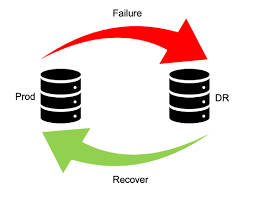
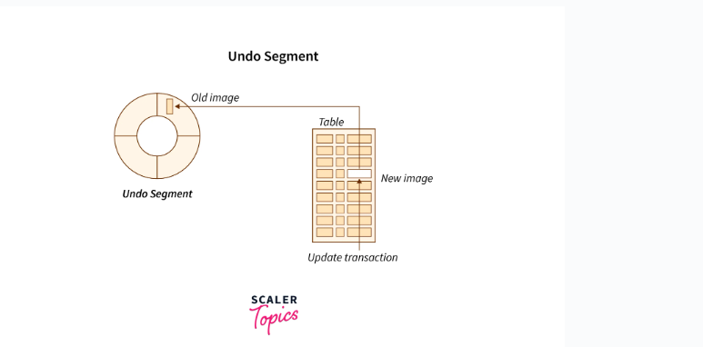
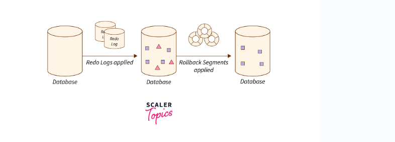
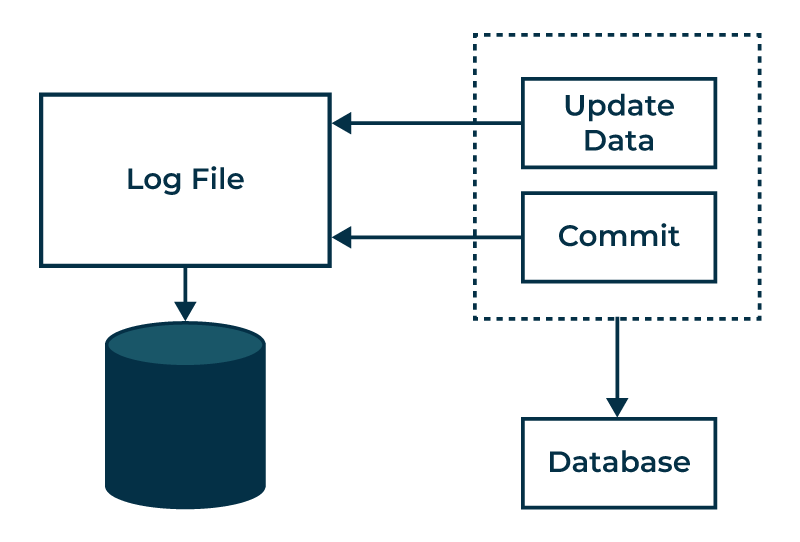
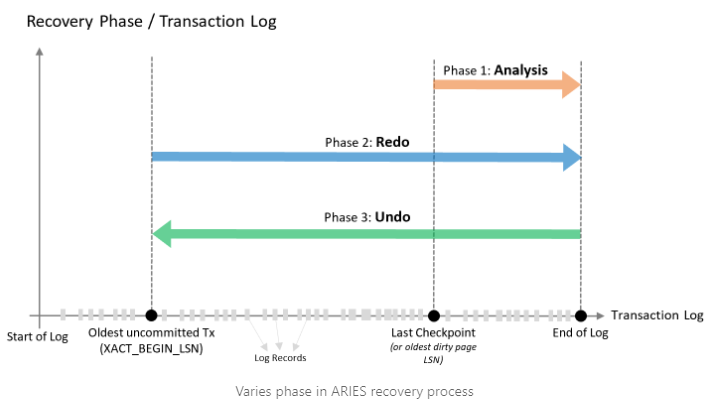
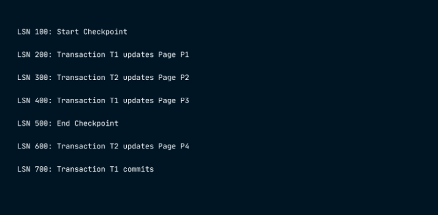

## What I learned during flipped class!

Hello there! Here’s another journal entry on my learnings from Flipped Class 12. Today, let's learn about the recovery system, and by the end of this journal, you should understand recovery mechanisms, analyze database recovery algorithms, and explain the importance of database logging in recovery. So, let's get started.


Recovery System
---

Database recovery is the process of restoring the database to a correct (consistent) state in the event of a failure. In other words, database recovery is the process of fixing the database after something goes wrong. It means bringing the database back to the last good state it was in before the problem happened.


### Why Recovery is Needed in Databases

Reasons why recovery is important in a DBMS:

Here are some reasons why recovery is important in a DBMS:

1. System Failures: Hardware issues, software bugs, or power outages can damage or lose data. Recovery fixes the database after these problems.
2. Transaction Failures: Transactions can fail due to network issues, deadlocks, or application errors. Recovery undoes these failed transactions to keep data correct.
3. Human Errors: Mistakes like accidental deletion or wrong data entry can mess up the database. Recovery fixes these errors and restores the data.
4. Security Breaches: Hacks or unauthorized access can harm data. Recovery fixes the database and secures it against further breaches.
6. Hardware Upgrades: Moving to new hardware can cause data loss or corruption. Recovery ensures data is safely transferred and stays correct.
7. Natural Disasters: Events like earthquakes, floods, or fires can destroy database hardware. Recovery restores data from backups to minimize damage.
8. Compliance Regulations: Some industries require data retention for legal reasons. Recovery ensures data is available for compliance even if accidentally lost.

9. Data Corruption: Data can get corrupted due to hardware issues, software bugs, or viruses. Recovery restores and fixes corrupted data.


### Log Based Recovery in DBMS

Log-based recovery in DBMS helps keep data safe when the system fails. The DBMS records every transaction on a stable storage device, making it easy to recover data after a failure. For every operation on the database, a log file is created. The original transaction is processed before it is applied to the database.


### How to Perform Log-Based Recovery in DBMS

#### key terms used in log-based recovery:
1. Transaction identifier: A unique ID for each transaction.
2. Data item identifier: A unique ID for each piece of data.
3. Old value: The value of the data before the change.
4. New value: The value of the data after the change.

#### Types of Log Records:
.png>)

When a transaction writes to the database, it first creates a log record. Reading data does not create a log record because it does not change the database's consistency and is not needed for recovery.
#### During the recovery process, we perform two main operations:
1. Undo(Ti): Reverts the changes made by transaction Ti, restoring the old values of the updated items.


2. Redo(Ti): Reapplies the changes made by transaction Ti, updating the items with their new values.


Undoing a transaction requires the log to have both the start and commit records.

#### Recovery using Log records
If the system crashes, it uses the log to decide which transactions need to be undone and which need to be redone.

1. Redo: If the log has both Ti start and Ti commit records, the transaction Ti needs to be redone.

2. Undo: If the log has a Ti start record but no Ti commit or Ti abort record, the transaction Ti needs to be undone.



### Approaches to Modify the Database

In a recovery system, we use two main ways to modify the database:

1. Immediate Database Modification
2. Deferred Modification Technique

#### Immediate Database Modification

With immediate updates, the database can be changed while the transaction is still active. These changes are called uncommitted modifications.

1. If the system crashes or a transaction fails, we use the old values of the data to keep the database consistent.
2. To undo an operation, the system reverts to these old values.
3. When a transaction starts, a log entry Ti start is created. Before any write operation by Ti, a new log record is written.
4. If a transaction is partially committed, the log will have Ti commit.

#### Example
```
<To start>
<To A, 850, 800>
<To B, 1000, 1050>
<To commit>
<T1 start>
<T1 C, 600, 500>
<T1 commit>
```
In the banking example, transaction To comes before T1. If the system crashes just after the log record, during recovery, we redo To and undo T1. This is because To start and To commit are in the log, but T1 commit is missing. So, we undo T1 first and then redo To.


#### Deferred Modification Technique

In deferred modification, all changes are first written in the log and then applied to the database after the transaction is partly confirmed.

1. A transaction is partly confirmed when all its actions are done on the database.
2. If a system crashes before the transaction is fully confirmed, the log details are not used.
3. The log helps the system recover from sudden data loss.
4. During recovery, the system uses the log to fix the values of data items updated by Ti. Redo actions must be able to be done again.

#### Example;

```
(A)
<To start>
<To A, 1000>
<To B, 305>

(B)
<To start>
<To A, 1000>
<To B, 3050>
<To commit>
<T1 start>
<T1 C, 500>
```

If the system crashes right after writing B in transaction To and To commit is missing in the log, no redo operations are done.
If the system crashes right after writing C and To start and To commit are in the log, but T1 commit is missing, only redo (To) is done.

#### Example ;
```
(C)
<To start>
<To A, 1000>
<To B, 3050>
<To commit>
<T1 start>
<T1 C, 500>
<T1 commit>
```
If the system crashes right after T1 commit, during recovery, both To and T1 are redone because the log contains To start, To commit, T1 start, and T1 commit.


### Recovery with Multiple Transactions

When multiple transactions run at the same time, their logs get mixed up. During recovery, it's hard to backtrack all logs. To make it easier, modern DBMS use 'checkpoints'.

#### Checkpoint

Keeping logs in real time and real environments can fill up memory quickly. As logs grow, they become too big to handle. Checkpoints solve this by removing old logs and storing them on a disk. They mark a point when the system was stable and all transactions were done.

When a system with multiple transactions crashes and recovers, it acts like this:


1. During recovery, the system reads logs backward from the end to the last checkpoint. It keeps two lists: an undo-list and a redo-list.
2. If the system finds a log with Tn start and Tn commit or just Tn commit, it adds the transaction to the redo-list.
3. If the system finds a log with Tn start but no commit or abort log, it adds the transaction to the undo-list.


 ARIES Algorithm
---
The ARIES algorithm is a strong tool for recovering SQL databases. It rolls back transactions effectively using a technique called Write Ahead Log (WAL). It's built to handle many different kinds of failures.

### How does ARIES work?



 key terms related to Write Ahead Log (WAL):

1. Log: This is like a diary recording every change made by transactions in the database. Before any transaction commits, its changes are written in this log to ensure records are always available.

2. LSN: Each log record gets a special number called Log Sequence Number (LSN). It's like a unique ID showing where the record sits in the log. Every database page also has a field called PageLSN, storing the LSN of the last log record that changed the page. The log also keeps track of key points like the start and end of the log, the oldest uncommitted transaction, and the last checkpoint.

3. Start of Log: This is where the log begins, marked by the LSN of the first record.

4. End of Log: This is where the log ends, marked by the LSN of the last record.

5. Oldest Uncommitted Tx: This refers to the transaction with the lowest LSN among those that haven't committed or aborted yet.

6. Checkpoint: To keep things efficient, the database often changes pages in memory (buffer cache) without immediately writing them to disk. Periodically, it initiates a checkpoint, moving modified pages and log details from memory to disk. This action is also logged in the transaction log. 
Different types of checkpoints exist, like automatic or manual ones.

7. Last Checkpoint: This is the LSN of the most recent checkpoint record in the log.


#### The three phases of ARIES are as follows

In the Analysis phase : ARIES looks at the log starting from the recent checkpoint to see which parts of the memory need updating on disk and which transactions were ongoing when the system crashed. For example, if the crash happens after LSN 700, it checks from the recent checkpoint (LSN 500) and finds that Page P4 needs updating and Transaction T2 was still going on.



In the REDO phase : the database gets updated by applying all the changes found in the Analysis phase, starting from the earliest log record and going to the end of the log. For example, it starts from LSN 200 and goes up to LSN 700.

The UNDO phase reverses :  changes made by transactions that didn't finish during the crash. It works backward from the end of the log. For example, starting from LSN 700, it would undo changes made by Transaction T2.

In ARIES, these steps help fix databases fast and correctly. But when there are big transactions to undo, it can take a long time. This can be a headache in busy places with lots of databases, as they might be down for a while during recovery. To fix this, SQL Database Hyperscale uses Accelerated Database Recovery (ADR) to make the rollback process and database recovery faster.


Conclusion
---

In summary, database recovery is super important for fixing problems and getting data back after things go wrong. It helps with system failures, mistakes, and keeping data safe. Log-based recovery keeps track of all changes, and different techniques like immediate and deferred modification help manage these changes. ARIES algorithm is great for recovery, but long transactions can make it tricky. Checkpoints help manage logs better. All in all, recovery systems like ARIES make sure data stays reliable and available, which is key for keeping databases safe and businesses running smoothly.